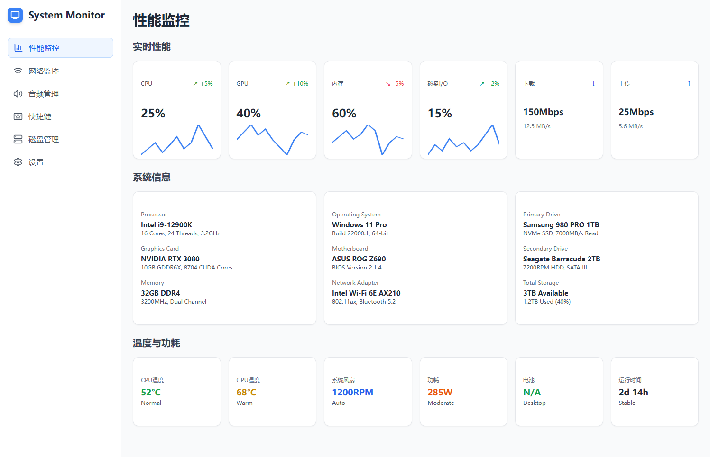

# Tauri + React + TypeScript + AI

一个基于 Tauri 和 React 构建的现代化系统监控应用程序，集成了 AI 功能和多语言支持。




## 功能特性

- 🖥️ **系统监控** - 实时监控 CPU、GPU、RAM 和磁盘使用情况
- 🌐 **网络管理** - 网络状态检测、Ping 工具、代理和 DNS 配置
- 🔊 **音频控制** - 麦克风和扬声器设置、实时音频电平监控
- ⌨️ **快捷键管理** - 自定义快捷键、系统快捷键查看、冲突检测
- 💾 **磁盘管理** - 存储分析、磁盘性能监控、磁盘工具
- ⚙️ **应用设置** - 主题、语言、字体大小等个性化设置
- 🌍 **多语言支持** - 支持中文、英文等多种语言切换
- 🎨 **现代化 UI** - 基于 Tailwind CSS 和 shadcn/ui 的响应式设计

## 技术栈

- **前端框架**: React 19.1.0 + TypeScript 5.8.3
- **桌面应用**: Tauri 2.x
- **构建工具**: Vite 7.0.4
- **UI 组件**: shadcn/ui + Radix UI
- **样式框架**: Tailwind CSS 3.4.17
- **图标库**: Lucide React
- **国际化**: i18next + react-i18next

## 快速开始

### 环境要求

- Node.js 18.0 或更高版本
- Rust 1.70 或更高版本（用于 Tauri）

### 安装依赖

```bash
npm install
# 或
yarn install
```

### 开发模式

```bash
npm run dev
# 或
yarn dev
```

### 构建应用

```bash
npm run build
# 或
yarn build
```

### 运行 Tauri 应用

```bash
npm run tauri dev
# 或
yarn tauri dev
```

## 项目结构

```
src/
├── components/          # React 组件
│   └── ui/             # shadcn/ui 组件
├── lib/                # 工具函数和配置
├── locales/            # 国际化文件
│   ├── en/            # 英文翻译
│   └── zh/            # 中文翻译
├── App.tsx            # 主应用组件
└── main.tsx           # 应用入口点

src-tauri/             # Tauri 后端代码
├── src/              # Rust 源代码
├── tauri.conf.json   # Tauri 配置
└── icons/            # 应用图标
```

## 主要功能模块

### 系统性能监控
- CPU、GPU、RAM 和磁盘 I/O 的实时数据
- 温度和功耗监控
- 系统信息展示
- 历史数据图表

### 网络管理
- 网络连接状态检测
- 本地和公共 IP 地址显示
- Ping 工具测试网络连通性
- 代理服务器配置
- DNS 服务器设置

### 音频管理
- 麦克风和扬声器设备选择
- 音量控制
- 实时音频电平监控
- 音频应用程序管理

### 快捷键管理
- 创建自定义快捷键
- 查看系统和应用程序快捷键
- 快捷键冲突检测
- 启用/禁用快捷键

### 磁盘管理
- 存储空间分析
- 磁盘性能监控
- 磁盘工具（清理、碎片整理、健康检查）
- 文件类型分布统计

### 应用设置
- 界面主题切换（浅色/深色/自动）
- 语言切换
- 字体大小调整
- 启动行为设置
- 通知设置
- 数据保留设置

## 贡献指南

1. Fork 本仓库
2. 创建功能分支 (`git checkout -b feature/AmazingFeature`)
3. 提交更改 (`git commit -m 'Add some AmazingFeature'`)
4. 推送到分支 (`git push origin feature/AmazingFeature`)
5. 创建 Pull Request

## 许可证

本项目采用 MIT 许可证 - 查看 [LICENSE](LICENSE) 文件了解详情。

## 联系方式

Maybe - 1913093102@qq.com

项目链接: [https://github.com/yourusername/Tauri-React-Ai](https://github.com/yourusername/Tauri-React-Ai)


